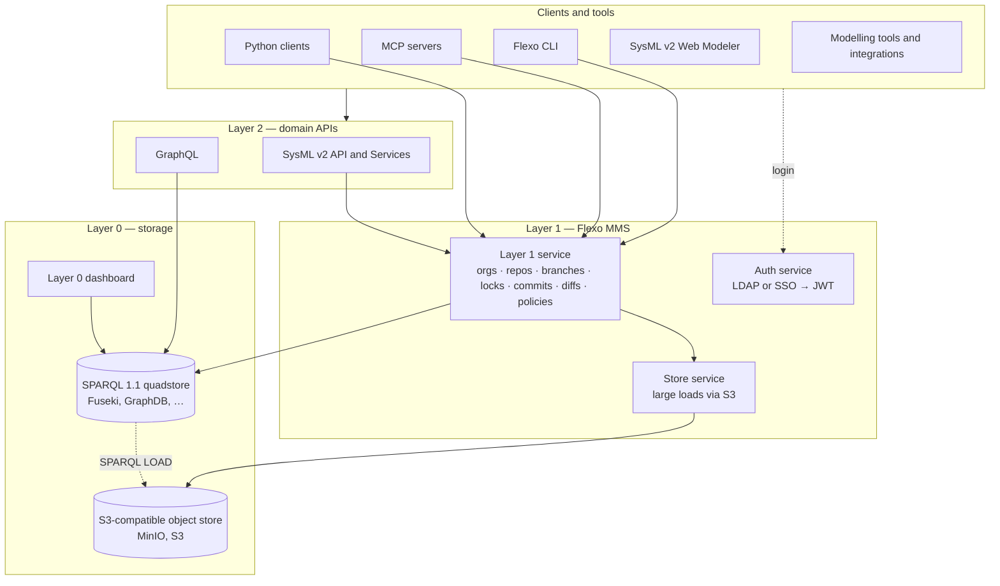

# Architecture

Flexo is layered. Each layer has one job, talks to the layer below over a standard
protocol, and can be replaced or scaled without the others knowing.

## Layer 0 — storage

The bottom of the stack is any SPARQL 1.1 compliant quadstore reachable over HTTP: the
Docker Compose stacks ship Apache Jena Fuseki and, as an alternative, Ontotext GraphDB.
Every organisation, repository, branch, commit and policy Flexo knows about is itself RDF
in that store, described by the [Flexo MMS ontology](tools/libraries.md#flexo-mms-ontology),
so the store is the whole state of the system and can be backed up, inspected or migrated
as one dataset.

Beside it sits an S3-compatible object store for the [Store service](services/store.md)
to stage large model files, and the [Layer 0 dashboard](services/dashboard.md), an
administrator's view straight onto the named graphs.

## Layer 1 — Flexo MMS

[Layer 1](services/layer1.md) is the model management system proper. It gives the graph
a version-control shape:

- **Organisations** own **repositories**; a repository has **branches**; a branch is a
  sequence of **commits**, each a SPARQL update applied to the model graph of its parent.
- A **lock** pins a commit so it can be queried by name; a **diff** is computed between
  any two commits.
- Reading is SPARQL 1.1 query against a branch, lock or the whole repository; writing is
  SPARQL 1.1 update, recorded as a commit, or a bulk **load** that replaces a branch's model
  from a file.
- **Policies**, **groups** and **collections** express access control, evaluated on every
  request. A deployment may answer an unauthorised request with 404 rather than 403, so an
  unprivileged caller cannot learn whether a resource exists.

Two supporting services complete the layer. The [Auth service](services/auth.md) turns a
credential — an LDAP bind, or an OAuth2/OIDC login or API key in the SSO variant — into a
signed JWT that Layer 1 trusts, and the [Store service](services/store.md) takes a large
file off the request path and hands Layer 1 a URL the quadstore can `LOAD` directly.

## Layer 2 — domain APIs

Layer 1 is deliberately generic: it knows RDF, not systems engineering. Domain-shaped APIs
sit above it.

- The [SysML v2 API and Services](services/sysmlv2.md) implements the OMG Systems Modeling
  API REST platform-specific model. A SysML v2 project maps to a Layer 1 repository and a
  SysML v2 commit to a Layer 1 commit, so tools that speak the standard get real branching,
  history and diffs without knowing the store underneath.
- [GraphQL](services/graphql.md) serves a GraphQL schema over the graph of any branch,
  compiling queries to SPARQL against a JSON-LD context, with GraphiQL for exploration.

## Clients and tools

Above the APIs are the things people and programs use: the git-style
[Flexo CLI](tools/cli.md) with its SysML v2 plugin, [MCP servers](tools/mcp.md) that put
either API in front of an AI assistant, [Python](tools/python.md) clients, the
[SysML v2 Web Modeler](tools/web-modeler.md) for graphical rendering and textual editing in
a browser, and [libraries and integrations](tools/libraries.md) such as the Jama SDK and
the SysIDE bridge.

## Deployment shape

Every service is a container image on Docker Hub under `openmbee/`. The
[deployment repository](services/deployment.md) carries a Docker Compose stack for one
machine and Kubernetes manifests — deployments, services, ingresses, config maps and
secrets — for a cluster. Configuration is by environment variable throughout, and the
JWT settings are the one thing every service must agree on.
